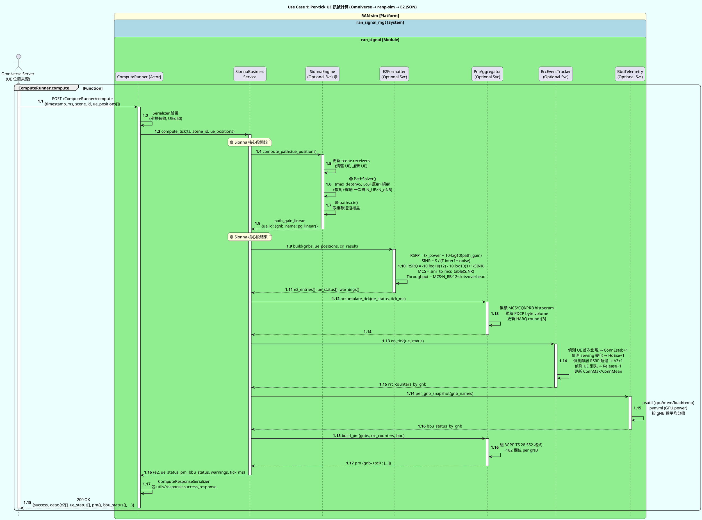
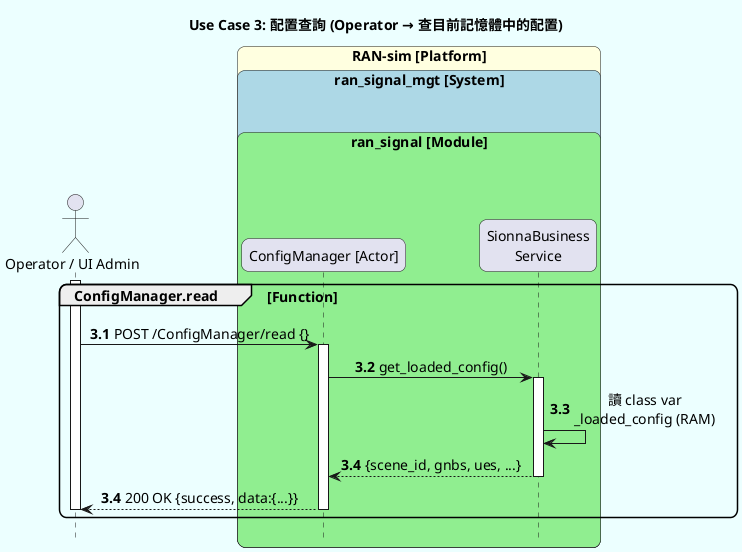
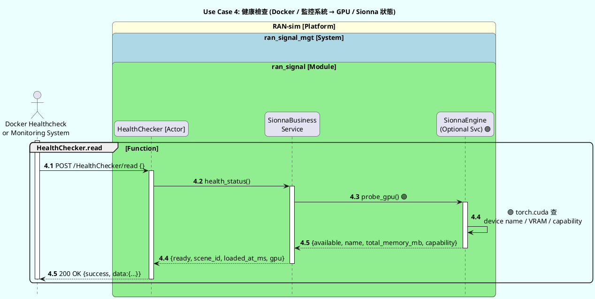

# ranp-sim 支援的 Use Case 與計算值總覽

**撰寫日期**：2026-04-18
**目的**：列出後端目前支援的所有對外功能、每個 flow 的 actor 互動、以及能計算/回傳的所有值。
**格式**：PlantUML sequence diagram（依 `/home/mitlab/Omniverse/Omniverse/DOC_ example/example_time_pic.md` 規範）。

**命名慣例**：
- Platform：`RAN-sim`
- System：`ran_signal_mgt`（RAN 訊號模擬管理）
- Module：`ran_signal`（Django app）
- Actor：**ComputeRunner** / **ConfigManager** / **HealthChecker**（API Actors）+ 外部 Entity（Omniverse / Operator）
- 🟣 **[Sionna]** 標記 = 這一步使用 Sionna RT 光追引擎

---

## Use Case 清單

| # | Flow 名稱 | 觸發者 | 頻率 | 有無 Sionna |
|---|---|---|---|---|
| 1 | Per-tick UE 訊號計算（主流程） | Omniverse Server | 500 ms | ✅ 核心 |
| 2 | 場景 / RAN 配置重載 | Operator | 按需 | ✅ engine 重建 |
| 3 | 配置查詢 | Operator | 按需 | ❌ |
| 4 | 健康檢查 | 監控 / Docker healthcheck | 30 s | ❌ |

---

## Use Case #1 — Per-tick UE 訊號計算（主流程 ⭐ 最核心）



### Use Case #1 — 能算出的所有值

#### Per-UE per-tick（即時 KPI）— 都由 🟣 Sionna 驅動

| 欄位 | 來源 | 單位 | 計算方式 |
|---|---|---|---|
| `rsrp` | 🟣 Sionna path_gain | dBm | `tx_power + 10·log10(Σ|a_i|²)` |
| `rsrq` | 推導 | dB | `-10·log10(12) - 10·log10(1+1/SINR)` |
| `sinr` | 推導 | dB | `serving / (Σ neighbors + noise)` |
| `neighbors[]` | 🟣 Sionna 對所有 gNB 算 | — | 保留 RSRP > serving-20dB 的鄰居 |
| `interfered` | 推導 | 0/1 | 任一鄰居 RSRP > serving-6dB 就 1 |
| `dl_throughput` | 推導 | Mbps | `sinr_to_mcs(SINR)` + TBS 估算 |
| `ul_throughput` | 推導 | Mbps | DL ÷ 5（TDD 4:1 近似） |
| `rb_start`, `rb_width` | 固定 | PRB | 預設全給 (rb_width = N_RB) |
| `role`, `ue_id` | 透傳 | — | 從輸入來 |

#### Per-UE 扁平 ue_status（給 UI 顯示用）

| 欄位 | 說明 |
|---|---|
| `position`, `ue_id` | 位置回放 |
| `serving_gnb`, `serving_pci` | 🟣 從 Sionna RSRP argmax |
| `rsrp_dbm`, `sinr_db` | 🟣 Sionna 源頭 |
| `all_rsrp{}` | 🟣 對每個 gNB 的 RSRP map |
| `throughput_dl_mbps` | 推導 |
| `quality` | `excellent/good/fair/poor`（SINR 分級）|

#### Per-gNB 累積 pm 區塊（對齊 3GPP TS 28.552）

**PHY / MAC 類**（🟣 根源 Sionna，累積而成）：
| 欄位 | 說明 |
|---|---|
| `du_CARR.PDSCHMCSDist.BinTable2.BinMCS<0-31>` | DL MCS 直方圖（從 throughput 反推的 MCS 累加）|
| `du_CARR.PUSCHMCSDist.BinTable1.BinMCS<0-31>` | UL MCS 直方圖 |
| `du_CARR.WBCQIDist.BinCQI<0-15>.BinTable2` | CQI 分佈（🟣 從 SINR → CQI (TS 38.214)）|
| `du_CARR.PRBUsageDLNbr`, `PRBUsageULNbr` | PRB 使用量累加 |
| `cu_DRB.PdcpSduVolumeDL_5QI9` | DL PDCP bytes (`tput × dt × 125000`) |
| `cu_DRB.PdcpSduVolumeUl_5QI9` | UL PDCP bytes |
| `cu_gnb.DRB.SdapSduVolume{DL,Ul}.5QI9` | SDAP bytes（=PDCP）|

**RRC / Handover / NAS 事件類**（狀態機推導）：
| 欄位 | 說明 |
|---|---|
| `cu_RRC.ConnEstabAtt.sum`, `ConnEstabSucc.sum` | UE 首次出現 → +1 |
| `cu_RRC.ConnMax`, `ConnMean` | 當下連線 UE 數的 max / EWMA |
| `cu_MM.HoExeIntraFreqReq`, `HoExeIntraFreqSucc` | 🟣 serving_gnb 跨 tick 變化 → +1（SINR>3 才 Succ）|
| `cu_MM.HoPrepIntraReq`, `HoPrepIntraSucc` | 🟣 A3 事件觸發時 +1 |
| `cu_gnb.MR.Event.A3` | 🟣 鄰居 RSRP > serving + 3dB 時 +1 |
| `cu_SM.PDUSessionSetupReq/Succ` | 跟 Estab 同步 |
| `cu_DRB.EstabAtt/Succ.5QI9` | 跟 Estab 同步 |
| `cu_UECNTX.Release.5GCinit.sum` | UE 消失 → +1 |

**設備 / 電源類**（從 bbu_status 借）：
| 欄位 | 說明 |
|---|---|
| `du_169:PEE.AvgTemperature` | CPU 溫度 |
| `du_170:PEE.MinTemperature`, `du_171:PEE.MaxTemperature` | 估 avg±5 |

**時序 / 信令細節**（輸出 `"0"`，真 RRC 才有）：
`ReEstab*`, `SigTime{Setup,Reconfig,ReEstab}*`, `PdcpPacketDiscard`, `AirIfDelay*`, `TB.TotNbr*`

#### Per-gNB bbu_status（host 遙測）

| 欄位 | 單位 | 來源 |
|---|---|---|
| `cpu` | % | psutil.cpu_percent() |
| `cpu_power` | W | Intel RAPL / TDP fallback |
| `cpu_temp` | °C | psutil.sensors_temperatures() |
| `load_average` | — | os.getloadavg() |
| `mem` | % | psutil.virtual_memory() |
| `tot_power` | W | GPU power (pynvml) + CPU 估 |

#### Meta 欄位

| 欄位 | 說明 |
|---|---|
| `timestamp_ms` | 透傳 |
| `compute_ms` | 本次 compute 耗時 |
| `tick_ms` | 兩次 compute 間隔 |
| `warnings[]` | 警告字串（如 UE id 未註冊）|

---

## Use Case #2 — 場景 / RAN 配置重載

```plantuml
@startuml UC2_config_reload
!pragma teoz true

title "Use Case 2: 場景 / RAN 配置重載 (Operator → scene_config.json → Sionna engine)"

skinparam backgroundColor #ECFFFF
skinparam roundcorner 15
skinparam DefaultFontSize 14

hide footbox
skinparam sequenceMessageAlign center

actor Operator as "Operator / CI\n(維運人員)"

box "RAN-sim [Platform]" #LightYellow
    box "ran_signal_mgt [System]\n\n" #LightBlue
        box "ran_signal [Module]\n\n" #LightGreen
            participant ConfigManager as "ConfigManager [Actor]"
            participant SionnaBusinessService as "SionnaBusiness\nService"
            participant SceneLoader as "SceneLoader\n(Optional Svc)"
            participant SionnaEngine as "SionnaEngine\n(Optional Svc) 🟣"
        end box
    end box
end box

database SceneConfigFile as "scene_config.json\n(專案根目錄)"
file MitsubaXML as "umi_3sector.xml\n(Mitsuba scene)"

activate Operator

group ConfigManager.reload [Function]
    autonumber 2.1
    Operator -> ConfigManager : POST /ConfigManager/reload {}
    activate ConfigManager

    autonumber 2.2
    ConfigManager -> SionnaBusinessService : reload_scene_config()
    activate SionnaBusinessService

    autonumber 2.3
    SionnaBusinessService -> SceneLoader : load(scene_config_path)
    activate SceneLoader

    autonumber 2.4
    SceneLoader -> SceneConfigFile : read JSON
    activate SceneConfigFile
    SceneConfigFile --> SceneLoader : {gnbs, ues, buildings}
    deactivate SceneConfigFile

    autonumber 2.5
    SceneLoader -> SceneLoader : 驗必填欄位\n自動補 pci / cell_id (若缺)
    SceneLoader --> SionnaBusinessService : parsed_config
    deactivate SceneLoader

    note over SionnaBusinessService: 🟣 Sionna engine 從頭建
    autonumber 2.6
    SionnaBusinessService -> SionnaEngine : __init__(mitsuba_scene_path, gnbs)
    activate SionnaEngine

    autonumber 2.7
    SionnaEngine -> MitsubaXML : load_scene()\n🟣 讀場景幾何 + 材質
    activate MitsubaXML
    MitsubaXML --> SionnaEngine : scene object
    deactivate MitsubaXML

    autonumber 2.8
    SionnaEngine -> SionnaEngine : 🟣 scene.frequency = f_GHz\n(自動套 ITU-R P.2040-3 材質 ε,σ)\n🟣 PlanarArray tx/rx\n🟣 Transmitter × N_gNB

    autonumber 2.9
    SionnaEngine -> SionnaEngine : 🟣 _warmup()\n跑 dummy compute 觸發 OptiX JIT

    autonumber 2.10
    SionnaEngine --> SionnaBusinessService : engine ready
    deactivate SionnaEngine

    autonumber 2.11
    SionnaBusinessService -> SionnaBusinessService : reset pm_aggregator + rrc_tracker\n(計數器歸零)

    autonumber 2.12
    SionnaBusinessService --> ConfigManager : loaded_config {scene_id, gnb_count, ...}
    deactivate SionnaBusinessService

    autonumber 2.13
    ConfigManager --> Operator : 200 OK {success, message: "Reloaded"}
    deactivate ConfigManager

    deactivate Operator
end group

@enduml
```

### Use Case #2 — 能算出的值

| 回傳欄位 | 說明 |
|---|---|
| `scene_id` | 成功載入的場景 ID |
| `loaded_at_ms` | 載入時間戳 |
| `gnb_count`, `ue_count`, `building_count` | 場景規模 |
| `gnbs[]` | 完整 gNB 配置（含 pci, cell_id, position, freq, power, BW） |
| `ues[]` | UE 名單（由 scene_config.json 定義，位置可被 per-tick 覆寫） |

---

## Use Case #3 — 配置查詢



### Use Case #3 — 能算出的值

同 Use Case #2 的 `loaded_config` 結構。純讀取，不計算新值。

---

## Use Case #4 — 健康檢查



### Use Case #4 — 能算出的值

| 欄位 | 說明 |
|---|---|
| `ready` | true = Sionna engine 已初始化 |
| `scene_id` | 當前載入的場景 |
| `loaded_at_ms` | Sionna engine 建立時間 |
| `gpu.available` | 🟣 GPU 是否可用 |
| `gpu.name` | 🟣 GPU 型號 |
| `gpu.total_memory_mb` | 🟣 VRAM 總量 |
| `gpu.capability` | 🟣 CUDA compute capability（SM 版本） |

---

## 🟣 Sionna 使用總覽

以下是**必須 Sionna 才能算出**的值（抽掉 Sionna 其他 RF 模擬器都算不出的）：

| 計算項 | Use Case | Sionna 提供 |
|---|---|---|
| Site-specific RSRP | UC1 (1.6-1.8) | 🟣 光追對每條路徑算複數增益 |
| NLOS 陰影效應 | UC1 | 🟣 建築物遮擋真實反映 |
| 建築物反射 / 繞射 / 穿透 | UC1 | 🟣 一次 PathSolver 全計算 |
| 鄰細胞 RSRP | UC1 | 🟣 同一 compute 對所有 gNB 算 |
| 材質頻率相依衰減 | UC2 (2.8) | 🟣 ITU-R P.2040-3 εᵣ, σ 自動隨 frequency 套 |
| 多徑 CIR（延遲+增益） | UC1 (1.7) | 🟣 `paths.cir()` 輸出多徑 tap |
| GPU 加速 | UC4 | 🟣 CUDA/OptiX 讓 70ms/tick 變可行 |

**反之**，這些值**不需要 Sionna**（從 Sionna 輸出後端處理）：
- 通道等化後 SINR 公式計算
- SINR → MCS 查表
- MCS → throughput 估算
- RRC / HO / NAS 事件計數器
- BBU CPU / 溫度 / 功耗（psutil + pynvml）
- PDCP byte volume 累積

---

## 📊 快速對照：輸入 → 輸出 矩陣

| 輸入給 ranp-sim | 經由 Actor | 觸發計算 | 回傳內容 |
|---|---|---|---|
| UE 位置 + 速度 | ComputeRunner | 🟣 Sionna 光追 + 狀態機 | e2[] + ue_status[] + pm{} + bbu_status{} |
| 空 (`{}`) | ConfigManager.reload | 🟣 Sionna engine 重建 | loaded_config |
| 空 (`{}`) | ConfigManager.read | 純讀 RAM | loaded_config |
| 空 (`{}`) | HealthChecker.read | 🟣 GPU probe | ready + gpu info |

---

## 📝 PlantUML 渲染

本文件含 4 個 `@startuml ... @enduml` block，可用：
- VS Code + PlantUML extension（即時預覽）
- `plantuml FILE.md` CLI
- 線上 http://www.plantuml.com/plantuml/uml/

或直接複製 block 到 https://mermaid.live 類工具（需先轉 mermaid 語法）。
