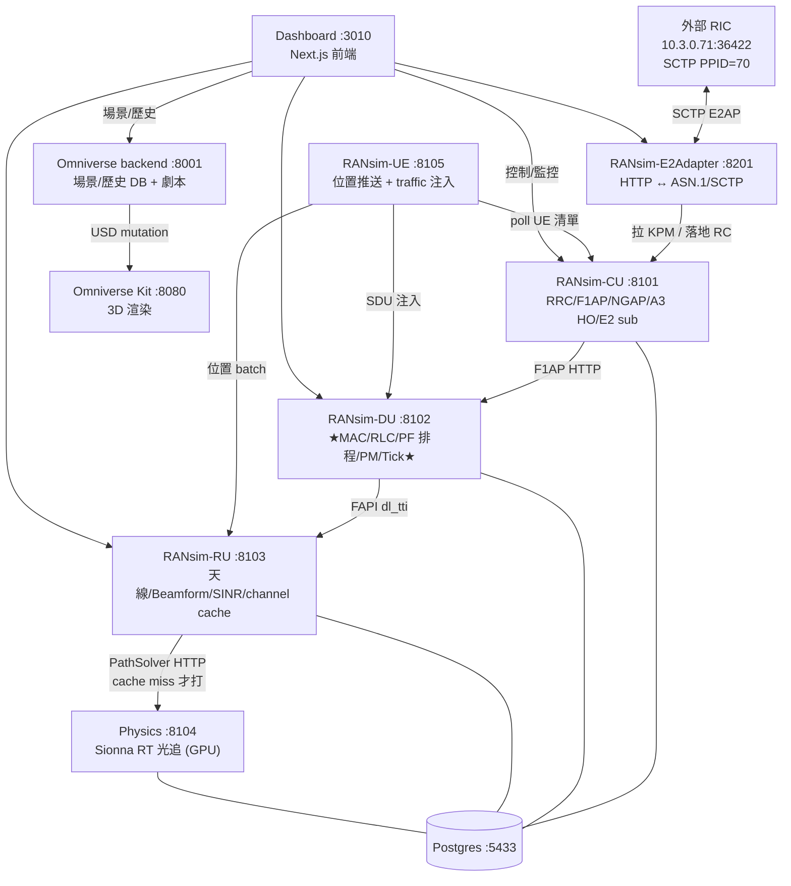
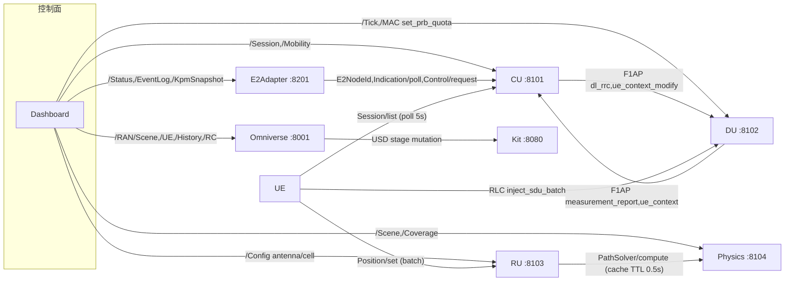
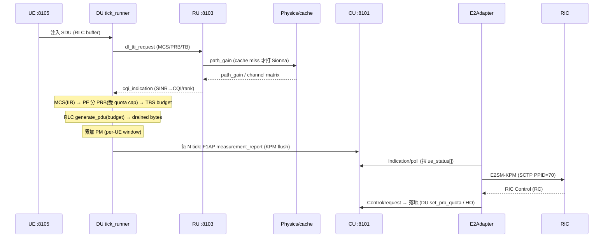
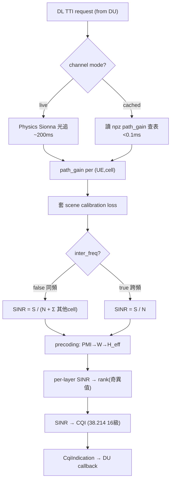
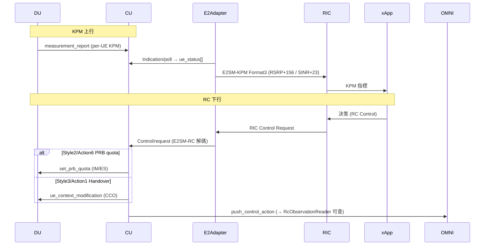

# DT RAN 架構總覽（第一版）

> 目的：把 **平台 → 模組（Django app）→ 模組內在算什麼 ↔ 對應真實 OAI RAN 的什麼** 三層打通成一份圖文並茂的架構總覽。
> 圖用 Mermaid（GitHub 直接渲染）。與既有 docs 互補，細節指過去不重抄（見 §7）。
> 若文件與程式碼有出入，**以原始碼為準**。

---

## §0 TL;DR + 怎麼讀這份文件

**一句話**：XAPP_DT 是分裂式 5G NR RAN 數位孿生，把 OAI/O-RAN 的 **CU/DU/RU/UE** 拆成獨立 Django HTTP 微服務，加 **Sionna RT 光追物理層（Physics）**、**Omniverse 3D**、以及 **HTTP↔ASN.1/SCTP 翻譯器（E2Adapter）** 對接外部真實 RIC，讓 **xApp 先在 DT 驗證 handover / PRB 控制決策，再上實體 RAN**。

**三層閱讀**：
1. **平台層（§1–§2）**：有哪些服務、誰呼叫誰、一個 tick 怎麼流。
2. **模組層（§3）**：每個服務內每個 Django app 在做什麼、對應 OAI 哪塊（廣度，一行一個）。
3. **計算層（§4–§5）**：核心模組內部的公式/模型，以及對照 OAI 原始碼（深度，只挑 6 個核心模組）。

**落差 / 限制** 見 §6，**延伸閱讀** 見 §7。

---

## §1 平台總覽

### 服務 × 埠 × 職責

| 服務 | 埠 | 角色 | 對應真實 RAN |
|---|---|---|---|
| RANsim-CU | 8101 | gNB-CU：RRC / F1AP / NGAP / A3 HO 決策 / E2 訂閱 | gNB-CU-CP + CU-UP |
| RANsim-DU | 8102 | **★模擬真實來源★** MAC/RLC/PF 排程/PM/Tick loop | gNB-DU |
| RANsim-RU | 8103 | 天線 / Beamform / SINR estimate / channel cache | O-RU |
| RANsim-UE | 8105 | 每 ~100ms 推 UE 位置(→RU) + traffic inject(→DU) | UE 群 |
| Physics | 8104 | Sionna RT 光追（GPU）~200ms/call + coverage | RF/channel 模型 |
| RANsim-E2Adapter | 8201(host net) | HTTP↔ASN.1/SCTP，拉 KPM / 落地 RC | gNB E2 termination |
| Omniverse backend | 8001 | 場景/UE/歷史 DB + playback（也是劇本權威來源） | — (視覺化/資料) |
| Omniverse Kit | 8080/6080 | 3D USD stage 渲染 | — |
| Dashboard | 3010 | Next.js 控制 + 監控前端 | — |
| Postgres | 5433 | cu_db / du_db / ru_db / physics_db（另有 omniver_db） | — |

外部 RIC：`10.3.0.71:36422`，SCTP PPID=70。全部由 repo 根 `docker-compose.yml` 拉起。

### 圖 D1：服務拓樸

### 圖 D2：HTTP 呼叫圖（誰呼叫誰）

**要點**：CU/DU/RU 各為**無狀態 Django 服務、以 HTTP REST 溝通**；配置**向內流**（Dashboard→服務），指標**向外流**（服務→E2Adapter→RIC）。跨服務同步 HTTP RTT 是主要的速度瓶頸（見 §6）。

---

## §2 一個 tick 的資料流

`DU tick_runner` 是整個 sim 的心跳：**每 tick 固定推進 `sim_dt=500ms` sim-time**（`SIM_DT_MS_DEFAULT=500`，= 3GPP 一個 measurement reporting period 的一半），wall 時間可縮短加速（`sim_speed_x = sim_dt_ms / wall_tick_ms`，例 wall=50 → 10x）。tick 內部再由 slot engine 以 **0.5ms slot** 建模 delay（§4.1）。

### 圖 D3：一個 tick 的資料流

PM window：預設 `sim_dt=500` + `PM_WINDOW=1.0s` → 恆定 2 ticks/window flush 一次 KPM。

---

## §3 逐服務模組地圖（廣度層：一行一個 Django app）

> 每列 = 一個 Django app（模組）。路徑相對於各服務 repo 根的 `main/apps/`。

### RANsim-CU（gNB-CU）

| 模組 | 路徑 | 算什麼 | 對應 OAI |
|---|---|---|---|
| `cu_cp` | `cu_cp/` | RRC 狀態機、A3 HO 評估、F1AP/NGAP/E2 訊令、UE context、KPM 匯集 | `RRC/NR/rrc_gNB.c`、`F1AP/f1ap_cu_*`、`NGAP/ngap_gNB.c` |
| `cu_up` | `cu_up/` | PDCP/SDAP/GTP-U 使用者面、E1AP bearer、DRB 管理 | `LAYER2/PDCP_v10.1.0/`、`LAYER2/SDAP/` |

### RANsim-DU（gNB-DU）★模擬真實來源

| 模組 | 路徑 | 算什麼 | 對應 OAI |
|---|---|---|---|
| `tick` | `tick/` | slot 時鐘(SFN/slot)、sim/wall 解耦、PM window、measurement_report 觸發、RLC delay 模型 | `gNB_scheduler_*` 主迴圈 |
| `mac` | `mac/` | PF 排程(2-pass/retx-aware)、HARQ、link adaptation(CQI→MCS)、PM 聚合、PRB quota | `NR_MAC_gNB/gNB_scheduler_*` |
| `rlc` | `rlc/` | AM/UM/TM entity、SDU→PDU 分段、retx 佇列、status PDU、SDU delay、BO | `nr_rlc/nr_rlc_entity.c`、`nr_rlc_am*.c` |
| `phy_high` | `phy_high/` | MCS→調變階數、layer mapping、BLER 查表、TBS/吞吐 | `LAYER1/NR_TRANSPORT/`（調變/編碼） |
| `f1ap_du` | `f1ap_du/` | F1Setup、UE context CRUD(建 RLC/MAC/HARQ)、DL/UL RRC 轉送、measurement_report 匯集 | `F1AP/f1ap_du_task.c` |
| `fapi_north` | `fapi_north/` | DL/UL TTI request 組裝、CQI→MCS 回饋、CRC→HARQ 回饋、in-process SINR(讀 channel cache) | nFAPI DL/UL TTI、CQI/CRC |

### RANsim-RU（O-RU）

| 模組 | 路徑 | 算什麼 | 對應 OAI |
|---|---|---|---|
| `antenna` | `antenna/` | 天線陣列/cell 定義/UE 位置 DB、`RuController` 配置 API | `PHY/MODULATION/antenna.c` + cell 身分 |
| `beamforming` | `beamforming/` | 38.211 Type I codebook、PMI 查找、precoder(W)、SINR/rank/CQI 估計 | `nr_modulation.c` codebook、`nr_ru_procedures.c::nr_feptx_prec` |
| `fapi_south` | `fapi_south/` | DL/UL TTI pipeline：physics/cache→真實多cell干擾→SINR→CQI/CRC 回 DU；live/cached 雙模；inter_freq 開關 | `nr_ru_procedures.c::ru_thread()` |
| `phy_low` | `phy_low/` | RU state(SFN/slot/numerology/FFT/CP)、OFDM 描述 | `nr_ru_timing.c`、`ofdm.c` |
| `physics_client` | `physics_client/` | 組 `PathSolverRequest` 打 Physics、L2 cache（同位置/配置不重打） | gNB RU→物理引擎 |

### RANsim-UE

| 模組 | 路徑 | 算什麼 | 對應 OAI |
|---|---|---|---|
| `scenario` | `scenario/` | 載劇本 JSON、套場景幾何(→Omniverse/Physics)、切 channel mode、bulk attach、進度 live_state（不自 tick，由 DU 驅動） | 測試框架（gNB boot + UE attach 序列） |
| `ue_lifecycle` | `ue_lifecycle/` | 每-UE 執行緒：poll CU 差異、trajectory 內插(~100ms)、推位置、traffic gen、量測輪詢 | NAS/RRC 狀態 + 量測回報(38.331 A3) |

### RANsim-E2Adapter（單一 app `e2_adapter`，子模組）

| 子模組 | 路徑 | 算什麼 | 對應 OAI/O-RAN |
|---|---|---|---|
| `codec` | `.../codec/` | E2AP PDU、E2SM-KPM Format3、E2SM-RC Header/Message、Subscription 的 APER 編解碼(pycrate) | E2AP v2.0.3、E2SM-KPM v2.0.03、E2SM-RC v01.03 |
| `sctp_link` | `.../sctp_link/` | SCTP 常駐 daemon、E2 Setup 握手、per-sub indication 執行緒、Reset debounce | OAI-CU→RIC e2term SCTP client |
| `event_log` | `.../event_log/` | KPM ring(per UE×metric，60 筆/30s stale)、事件 ring | — |
| `sim_bridge` | `.../sim_bridge/` | HTTP client 打 sim CU：拉 E2 node id / indication、落地 control | — |

### Physics（單一 app `ran_signal` + 離線 precompute）

| 模組 | 路徑 | 算什麼 | 對應 OAI |
|---|---|---|---|
| `ran_signal` actors | `ran_signal/actors/` | PathSolver/Coverage/Precompute/Config/Health REST 端點 | RF/channel 存取層 |
| `sionna_operations` | `.../services/business/` | Sionna 引擎 singleton：載 Mitsuba 場景、compute_paths、compute_coverage_map | RF hardware/channel 模擬 |
| `ran_calculation` | `.../services/optional/` | sionna_engine、coverage_solver、scene/mitsuba builder、頻率驗證 | 通道模型 |
| `precompute` | `precompute/run_precompute.py` | 離線把 (tick,ue,cell) path_gain 算成 `.npz` 供 cached 模式查表 | 「錄好回放」 |

### Omniverse backend（單一 app `ran`）

| 子模組 | 路徑 | 算什麼 |
|---|---|---|
| `ran/actors` | scene/ue/gnb/building/ingest/history/playback/sim_session/control_action/handover/scenario/asset | 場景/UE/歷史 CRUD + playback + **RC 觀察查詢**（`RcObservationReader`，見 `docs/api/rc_observation_api.md`） |
| `ran/models` | BuildingObject/GnbConfig/UeConfig/SignalHistory/PositionHistory/SimulationSession/ControlAction | 場景表 + 遙測/控制歷史 |

---

## §4 核心模組深入（深度層：計算 ↔ OAI）

### §4.1 DU tick / slot engine — `tick/services/optional/runner/tick_runner.py`

- **時基**：每 tick 推進 `sim_dt=500ms`；`sim_speed_x = sim_dt_ms / wall_tick_ms`（`_wall_tick_ms = min(500, SIM_TICK_MS)`）。tick 內部由 slot engine 以 **0.5ms slot** 逐 slot 建模，`SLOT_ENGINE_TAKEOVER=on` 時 KPM delay 直接取 slot engine 結果（不再 ÷30）。
- **每 slot 做的事**：control-plane K0 pipeline（到達→可排）、TDD 上下行、scheduler 給 PRB → TBS、FIFO drain、departure timestamp → SDU delay；BLER/HARQ retx。
- **RLC delay 兩模型**：
  - `calib`：wall 代理 + **÷30** 經驗擬合（快，對齊 OAI 低載 ~12–22ms）。
  - `subtick`：sim-time FIFO 佇列延遲（誠實壅塞，壅塞才會真的爬）。
  - `discardTimer`（預設 300ms）：SDU 超時丟棄，封頂過載假延遲。
- **↔ OAI**：等同 `NR_MAC_gNB/gNB_scheduler_*.c` 的每-slot 迴圈迭代。

### §4.2 DU MAC PF scheduler — `mac/services/optional/scheduler/pf_scheduler.py`

- **PF metric**：`PF(u) = inst_rate(u) / avg_rate(u)`；`avg_rate` 以 IIR(α=0.05)更新。
- **two-pass 分配**：
  1. Pass1：`alloc = min(prb_fair_share, prb_needed)`，`prb_needed = ceil(buffer_bytes×8 / bits_per_PRB_per_tick)`。
  2. Pass2：剩餘 PRB 貪婪重分給仍缺的 UE。
- **retx-aware demand**（`SLOT_SCHED_RETX_AWARE`）：`prb_needed ×= 1/(1-BLER)`，避免重傳下低估。
- **操作點 MCS**：takeover 時用「首傳 BLER≤10% 點」而非樂觀 `sinr_to_mcs`。
- **PRB 地板**：`MIN_PRB=5`（對齊 OAI `nr_find_nb_rb` 的 `min_rbSize`）；另有 `SLOT_OP_PRB_FLOOR=12` 低載地板。
- **link adaptation**：SINR→CQI（RU 回）→MCS（查表 + IIR α=0.05），MCS∈[0,27]→QPSK/16/64/256QAM（38.214）。
- **PRB quota**：xApp E2 Style2/Action6 或劇本 `cell_quotas` 下 `set_prb_quota` 封頂。
- **↔ OAI**：`NR_MAC_gNB` scheduler + HARQ + link adaptation。

### §4.3 DU RLC — `rlc/`

- **entity**：per `(ue_id, bearer_type, bearer_id)` → TM/UM/AM。
- **分段**：RLC SDU（來自 PDCP）依 PRB 預算切成 PDU。
- **AM**：tx_buffer + retx queue；CRC 失敗 retx_count++；status PDU 出 NACK bitmap。
- **BO**：`tx_buffer + retx_queue` bytes → 回報 scheduler（驅動 `prb_needed`）。
- **delay**：SDU 到達→送出時間 → KPM `DRB.RlcSduDelayDl`。
- **↔ OAI**：`nr_rlc/nr_rlc_entity.c`、`nr_rlc_am*.c`。

### §4.4 RU DL SINR pipeline — `fapi_south/services/optional/dl_tti_pipeline.py`

- **live vs cached**：live 每 tick 打 Sionna(~200ms)；cached 讀 `channel_cache/{scenario_id}.npz` 查表(<0.1ms)。
- **真實多cell干擾**（非舊的 20dB hack）：
  - `inter_freq=false`（同頻）：`SINR = S / (N + Σ_other cell 干擾)`。
  - `inter_freq=true`（跨頻/隔離）：`SINR = S / N`。
  - `S`、干擾都用真實 path_gain × 各 cell `tx_power`。
- **旋鈕**（劇本/env）：`tx_power_dbm`、`inter_freq`、`noise_floor`(-98dBm)、scene_calibration_loss。
- **precoding→CQI/rank**：查 38.211 codebook PMI→precoder→H_eff→per-layer SINR→rank(奇異值)→38.214 16 級 CQI。
- **↔ OAI**：`nr_ru_procedures.c::ru_thread()`。⚠ 已知 tx_power 硬編 bug 見 §6。

#### 圖 D4：RU SINR pipeline

### §4.5 Physics Sionna — `ran_signal/services/business/sionna_operations.py`

- **PathSolver**（RU 即時查）：載 Mitsuba 場景→建 Transmitter(每 gNB) + Receiver(UE)→光追(max_depth 反彈)→取 channel matrix + `path_gain_linear`。engine lock 防並發改 receiver。
- **Coverage**（Dashboard 熱圖）：水平 XZ 網格、高 1.5m、`RadioMapSolver`；per grid 算各 gNB RSRP，選配 SINR（全 cell − serving = 干擾），null 門檻 -120dBm。計算時 **暫停 DU tick**（GPU 爭用）。
- **Precompute**（`precompute/run_precompute.py`）：離線逐 tick 內插 UE 位置→in-process `compute_paths()`（免 HTTP，快 100x）→堆成 `[tick,ue,cell]` path_gain→寫 `.npz`。cached 模式即讀此檔。
- **↔ OAI**：取代 RF hardware/channel model（`RADIO/RF/`）；cached 類似「錄好 path_gain 回放」而非 IQ。

### §4.6 E2Adapter codec + E2 閉環 — `e2_adapter/services/optional/codec/`

- **上行 E2SM-KPM Format3**（UE-level）：`MeasInfoList` + per-UE `MeasurementRecordItem`。量化（38.133）：
  - **RSRP**：`-156..-31 dBm → +156`（0..125）。
  - **SINR**：`-23..40 dB → +23`。
- **下行 E2SM-RC**（xApp 控制，經 CU `e2_control_actor` 落地）：
  - **Style 2 / Action 6**：slice-level **PRB quota**（IM/ES）→ DU `set_prb_quota`。
  - **Style 3 / Action 1**：**Handover**（CCO）→ CU `nr_HO_F1_trigger` → DU `ue_context_modification`。
  - **Style 2 / Action 7**：**Cell On/Off**（ES 節能）。
- **傳輸**：SCTP PPID=70、E2 Setup 握手、per-sub indication 執行緒、Reset debounce。
- **RC 觀察查詢 API**：CU 每筆 RC 落地會 `push_control_action` 到 Omniverse，可經 `RcObservationReader` 拉取（`docs/api/rc_observation_api.md`）。
- **↔ O-RAN**：E2AP/E2SM-KPM/E2SM-RC 規範。

#### 圖 D5：E2 閉環（KPM 上行 + RC 下行）

**三條 xApp 閉環**（合約見 `intents-interface.md`）：

| Case | KPM 輸入 | RC 動作 | 落地點 |
|---|---|---|---|
| **IM** 干擾管理 | PrbTotDl + UEThpDl + RlcSduDelayDl | Style2/Action6 PRB quota | DU `set_prb_quota` |
| **CCO** 覆蓋容量 | PrbTotDl 跨 gNB 差距 | Style3/Action1 handover | CU HO → DU ue_context_modification |
| **ES** 節能 | PrbTotDl + PdcpSduVolumeDL(5min窗) | HO + PRB quota / Cell On-Off | 兩段組合 |

---

## §5 DT 模組 → OAI 對應總表（速查）

| DT 服務 | DT 模組 | OAI 原始檔 / 概念 |
|---|---|---|
| CU | cu_cp | `RRC/NR/rrc_gNB.c`、`F1AP/f1ap_cu_*`、`NGAP/ngap_gNB.c` |
| CU | cu_up | `LAYER2/PDCP_v10.1.0/`、`LAYER2/SDAP/`、E1AP |
| DU | tick | `NR_MAC_gNB/gNB_scheduler_*.c` 主迴圈 |
| DU | mac | `NR_MAC_gNB` scheduler + HARQ + link adaptation |
| DU | rlc | `nr_rlc/nr_rlc_entity.c`、`nr_rlc_am*.c` |
| DU | phy_high | `LAYER1/NR_TRANSPORT/`（調變/編碼/TBS） |
| DU | f1ap_du | `F1AP/f1ap_du_task.c` |
| DU | fapi_north | nFAPI DL/UL TTI、CQI/CRC |
| RU | beamforming | `nr_modulation.c` codebook、`nr_ru_procedures.c::nr_feptx_prec` |
| RU | fapi_south | `nr_ru_procedures.c::ru_thread()` |
| RU | phy_low | `nr_ru_timing.c`、`ofdm.c`（38.211 numerology→FFT） |
| Physics | ran_signal | `RADIO/RF/` channel model 取代（Sionna RT） |
| E2Adapter | codec | O-RAN E2AP v2.0.3 / E2SM-KPM v2.0.03 / E2SM-RC v01.03 |
| E2Adapter | sctp_link | OAI-CU→RIC e2term SCTP client（PPID=70） |
| UE | ue_lifecycle | NAS/RRC 狀態 + 量測回報（38.331 A3） |

---

## §6 已知落差 / 限制（第一版先列，細節指過去）

- **RU tx_power 硬編**：RSRP pipeline 有硬 code TX power 的歷史問題，改 per-gNB `power_dbm` 在 KPM 端可能沒反應；另有 antenna gain 雙重計算。詳 `../sionna_compute_and_params.md §4`。（本 session 已把 tx_power/inter_freq 做成 runtime 旋鈕，見 §4.4。）
- **RlcSduDelayDl 為秒級（結構性）**：UE 為省 HTTP 把整 tick 打包成 MB 級「邏輯 SDU」；`calib` 又 ÷30 壓平壅塞。語意對、絕對值不真實。詳 `../slot_engine_delay_commits_explained.md`。
- **速度上限 ~7–8x**：cached 拔掉 Sionna 後仍卡在 DU per-tick wall ~63ms（跨容器同步 HTTP RTT），不是 Sionna/CPU。詳 `../LLM_ONBOARDING.md §5`。
- **Coverage vs KPM 雙 pipeline 分歧**：RSRP 在 Coverage(熱圖) 與 RU dl_tti(KPM) 兩處算、tx_power 來源不同 → 可能靜默不一致。詳 `../sionna_compute_and_params.md §3`。

---

## §7 延伸閱讀

- `../LLM_ONBOARDING.md` — 30 秒全貌 + 拓樸 + tick 流 + 瓶頸。
- `../xapp_dt_architecture.md` — 完整服務/端點/分工矩陣。
- `../sionna_compute_and_params.md` — 物理層參數與已知 bug。
- `../slot_engine_delay_commits_explained.md` — delay 模型演進（÷30 → 0.5ms slot engine）。
- `../scenario_control_reference.md` — 劇本欄位 + 參數控制面 + cached/live。
- `../../intents-interface.md` — xApp 三 case 合約（IM/CCO/ES）。（在 repo 根，非 docs/）
- `../api/rc_observation_api.md` — RC 指令拉取 API（`RcObservationReader`）。

> 版本：第一版（分層式）。§4 只深入 6 個核心模組；其餘模組維持 §3 一行摘要，v2 再升級。
